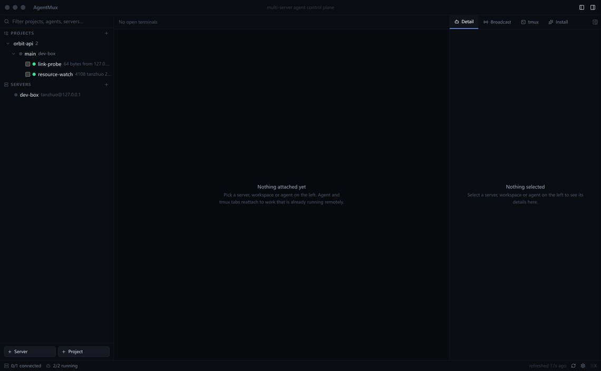
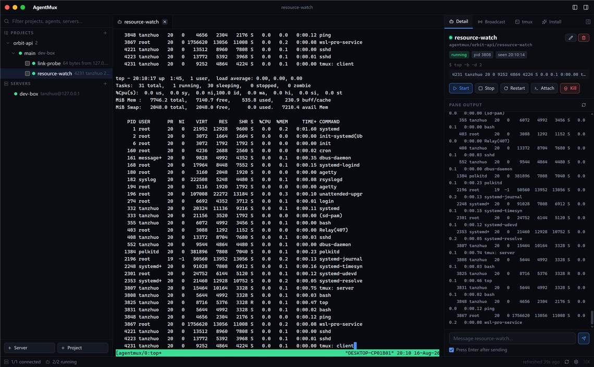
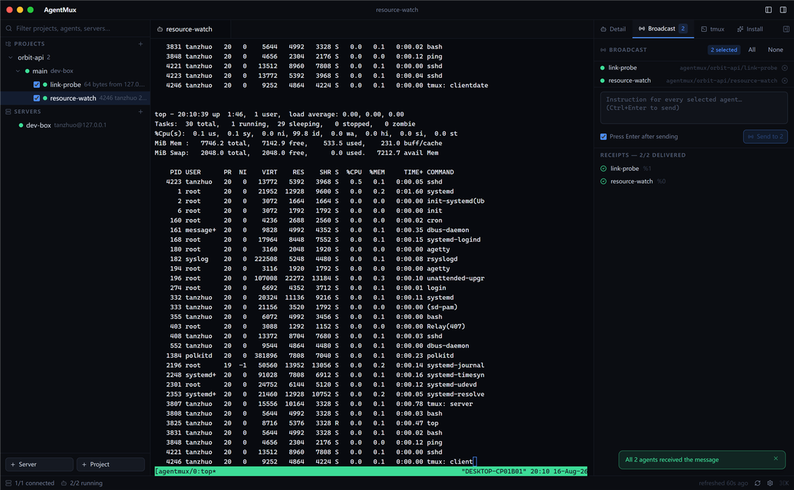
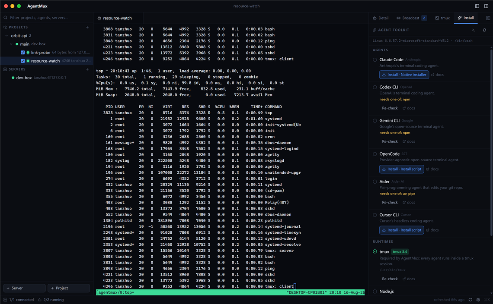
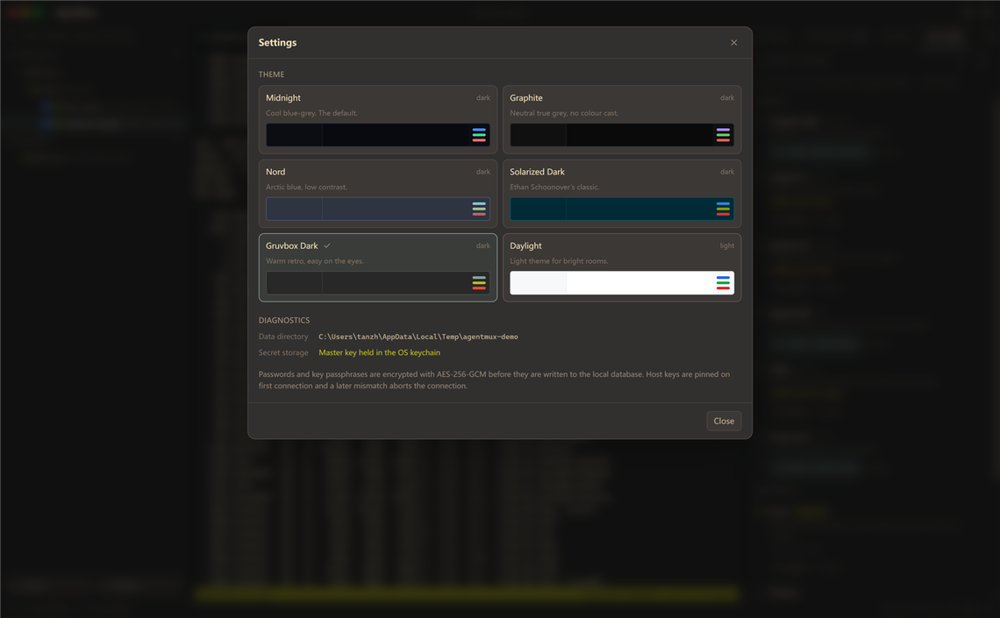

# AgentMux

**A desktop control plane for AI coding agents — on remote hosts, and on this one.**

English · [中文](README.zh-CN.md)



---

## Overview

AgentMux operates coding agents — Claude Code, Codex, Gemini CLI, Grok CLI,
OpenCode, Aider, Cursor CLI — that execute on the machines where the work belongs: build
servers, GPU boxes, staging hosts, and this computer alongside them. Every agent
runs inside a `tmux` session on its host, and the application attaches to that
session instead of owning the process. Closing the client, suspending the laptop
or losing the network therefore has no effect on work in progress.

It ships as a single binary with no server component, no daemon and no account.
All state is one SQLite file in the user's application data directory.

## Capabilities

**Session persistence.** Agents survive client disconnection by construction.
Reopening a terminal reattaches to the same pane with its scrollback intact, so
a four-hour migration is not tied to an SSH session staying up.



**Direct terminal access.** Each agent's pane is a full terminal — colour, mouse
reporting, selection, search — not a transcript view. An operator can intervene
mid-task, correct the agent and hand control back without restarting the run.

**Several sessions on screen at once.** The terminal area divides into up to nine
panes — two or three along either axis, more as the squarest grid that fits, up to
a 3×3 wall — each holding its own session, on one host or on several, each
independently interactive. The arrangement follows the space it has: panes divide
the area in proportions rather than pixels, and a column too narrow to read is
dropped, so narrowing the window wraps a 3×3 wall into a taller grid instead of
leaving nine slivers. Seams are draggable, and any one pane can fill the area for
a moment — double-click its tab — without disturbing the split it came from. A
pane is a view rather than a session: closing it hides the terminal and leaves the
shell attached, and the number of panes is restored on the next start. One dialog
fills a pane from the hosts, workspace directories, running agents and open tabs
available, so watching two agents on two servers costs a keystroke and a choice
rather than an exercise in window management.

**This computer, as a host.** The machine AgentMux runs on is managed like any
other: same tree, same shells, same file browser, and agents in a local `tmux`
session — so quitting the application does not stop them there either. It needs no
sshd, no account and no credentials, because nothing is dialled. On Windows the
same computer offers two hosts: its default WSL distribution, where `tmux` lives,
and native Windows itself — PowerShell, Windows paths, Windows toolchains — for
the work WSL cannot do: MSVC builds, WPF, running the `.exe` that was just built.
Native sessions persist through AgentMux's own session daemon, a small detached
broker that owns each session's terminal and scrollback, so closing the window
does not stop native work either.

**Coordinated dispatch with delivery receipts.** One instruction can be sent to
any selection of agents, and each returns a receipt confirming whether it was
delivered. Fan-out to a fleet is auditable rather than assumed.



**Local orchestration under human approval.** A local model, served by Ollama,
can be given an objective — for example, determining why a specific agent has
stopped progressing. It inspects fleet state, retrieves prior context and
proceeds one tool call at a time. Any operation that modifies a host is held for
explicit approval, presented with the tool, its arguments, the target host and
the model's stated justification. Destructive operations are confirmed on every
host regardless of its trust level. Scheduled patrols are restricted to read-only
tools. The orchestrator is disabled until an operator enables it.

**Retrieval memory, retained locally.** Project facts, stated preferences and
agent activity are indexed for retrieval by wording or by meaning. Embeddings are
produced locally; no content is transmitted off the machine. Credentials matching
known patterns are redacted before storage, because the operative risk is a token
being re-supplied to a model on every matching retrieval.

**Reusable procedures.** Operational procedures can be recorded as skills — the
conditions under which one applies, the steps, the tools involved and the
constraints — and are matched automatically when those conditions recur.
Procedures proposed by the orchestrator enter a review queue and have no effect
until approved.

**Host provisioning.** The install panel inspects a host and offers only the
agent CLIs and runtimes it can actually support, stating why others are
unavailable. Installation runs inside `tmux`, so an interrupted connection cannot
leave a partial package tree.



**Host telemetry and file access.** Per-host metrics — CPU by mode and by core,
memory, load, disk usage and throughput, network, file descriptors, NVIDIA GPU
utilisation — are collected in a single command. An SFTP browser and editor
provide file access over the same connection, with atomic writes and a
modification check that refuses to overwrite changes made by an agent working in
the same directory.

**Interface.** Apple's system palette by default, with six alternative themes
including Nord, Solarized and a light theme.



## Operating scenarios

- **Long-running workloads.** Migrations, refactors and test campaigns that
  outlast a working session or a network link.
- **Multi-host fleets.** Three to fifty hosts with concurrent agent activity,
  presented as one tree with per-agent status and last output.
- **Coordinated changes.** Instructing an entire fleet in one action, with
  confirmation of what was delivered.
- **Provisioning.** Bringing a new host to a working state without assembling
  install commands by hand.
- **Unattended monitoring.** Scheduled read-only patrols that report agents which
  have stalled, without authority to act on them.
- **Restricted environments.** Planning, embedding and memory run locally.
  AgentMux does not proxy agent model traffic and does not read agent API keys.

## Limits

Stated plainly, because they decide whether this is the right tool:

- **One operator per installation.** State, credentials and the decision log live
  on the workstation. There is no shared server, no team account and no central
  audit sink; two people working the same fleet see the same `tmux` sessions but
  keep separate histories.
- **Model spend is out of scope.** Agent traffic goes from the host to whichever
  provider the agent CLI is configured for. AgentMux does not proxy it and does
  not read the keys — which also means it cannot report cost or enforce a budget.
- **Remote POSIX targets need `tmux`.** A POSIX shell and `tmux` are required
  on every remote Unix-like host, plus SSH. Windows — this computer's native
  side, or a remote machine running OpenSSH Server — is hosted through
  AgentMux's own session daemon instead, since `tmux` cannot exist there; for a
  remote Windows host the daemon is deployed over SFTP on first use and its
  protocol rides an SSH port forward, never a remote shell.
- **It does not decide what agents do.** Objectives, prompts and repository
  conventions remain the operator's; the orchestrator investigates and proposes,
  and needs approval to act.
- **Builds are unsigned.** Installation states the extra step this adds per
  platform.

## Security model

| Area | Behaviour |
|---|---|
| Credentials | Passwords and key passphrases are encrypted with AES-256-GCM before storage. The key is held in the OS keychain — Credential Manager, Keychain, or Secret Service. If the keychain is unavailable, AgentMux falls back to a `0600` file and reports this in the status bar. |
| Host identity | Host keys are pinned on first connection. A subsequent mismatch aborts the connection with an explanation. |
| Frontend exposure | Secrets never cross into the UI process. The interface learns only whether a secret is set. |
| Orchestrator authority | Tools are a fixed whitelist bound to existing services. Each carries a risk tier fixed at declaration. Execution is reachable only through a single gate, which combines the tier, the host's trust level and the run's trigger. |
| Unattended execution | Scheduled runs are refused every non-read tool unconditionally; the restriction is not configurable. |
| Untrusted input | Output from remote hosts reaches the model inside a delimited block marked as data. Instruction-shaped text raises a flag on the approval card and in the decision log. |
| Destructive actions | Deleting anything inside AgentMux never stops remote work: removing a workspace or an agent record leaves the `tmux` session running. The one control that destroys a running session is named Kill, and it confirms first, stating what is lost. |
| Auditability | Every step of every run is recorded, including proposals that were refused, rejected or left unanswered. |

## Requirements

Remote hosts need `tmux` and an SSH account; AgentMux can install `tmux` where it
is missing. Managing this computer needs the same `tmux` — on Windows a WSL
distribution provides it, while the native Windows host needs nothing beyond
PowerShell, which every Windows has. Local orchestration and memory search additionally require
[Ollama](https://ollama.com) with a chat model and an embedding model; without it
the rest of the application is fully functional.

Linux requires GTK3 and WebKitGTK 4.1 at run time — `libwebkit2gtk-4.1-0` on
Debian and Ubuntu, `webkit2gtk4.1` on Fedora. macOS 11 or later. Windows 10 or
later.

## Installation

Each release provides a build per platform, produced by GitHub Actions from the
tagged commit, with a `.sha256` alongside.

| File | Contents |
|---|---|
| [`agentmux-macos-universal.zip`](../../releases/latest) | `AgentMux.app`, universal binary for Intel and Apple silicon |
| [`agentmux-windows-amd64.zip`](../../releases/latest) | `agentmux.exe` and an installation script |
| [`agentmux-linux-amd64.tar.gz`](../../releases/latest) | binary, icon, `.desktop` entry and `install.sh` |

Builds are not code-signed or notarized, which requires an Apple developer
account and a Microsoft certificate. On Windows, select "More info" then "Run
anyway". On macOS the procedure depends on the version:

| macOS version | Procedure |
|---|---|
| 15 Sequoia or later | Open, allow it to be blocked, then System Settings → Privacy & Security → Security → **Open Anyway** |
| 14 Sonoma or earlier | Control-click the application → **Open** → Open |
| Any version | `xattr -dr com.apple.quarantine /Applications/AgentMux.app`, then open normally |

The quarantine attribute is applied by the browser rather than by the archive;
downloading with `curl -L -O <url>` avoids it.

## Getting started

1. **Add a host.** Either a remote machine — address, user, and one of ssh-agent,
   key or password, with jump hosts supported and the host key pinned on first
   connection — or this computer, which asks for nothing but a name.
2. **Add a project and a workspace** — a working directory on that host. Or skip
   the forms: browse the host's files, find the directory and add it as a
   project there, since its name, path and host are already known.
3. **Add an agent**: a name and the command that starts it. Select Start.
4. `Ctrl+K` opens the command palette — the fastest route to attaching to an
   agent, opening a shell, installing a CLI or changing theme.

| Shortcut | Action |
|---|---|
| `Ctrl/⌘ K` | Command palette |
| `Ctrl/⌘ B` | Show or hide the tree |
| `Ctrl/⌘ \` | Add a pane — instantly with the next open tab, otherwise asking what to attach |
| `Ctrl/⌘ ⇧ \` | Close the pane, leaving the tab and its shell open |
| `Ctrl/⌘ ⇧ ↵` | Fill the area with the focused pane, and back again |
| `Ctrl/⌘ ⌥ ←` `→` | Move between panes — zoomed, this reads them one at a time |

## Tablets and phones (serve mode)

The same executable also runs headless, serving the full app to any browser —
an Android tablet, an iPad, a phone. Releases ship a dedicated server build,
`agentmux-server-linux-{amd64,arm64}`: a fully static headless binary with no
GTK, no webview and no display needed — copy it to any Linux server and run
it. The desktop build enters the same mode with `--serve`:

```bash
./agentmux                      # server build: serves by default on :8642
agentmux --serve --addr 0.0.0.0:8642   # desktop build, same thing
```

The first start generates an access token and prints it in the log (persisted
as `serve-token` in the data directory; `AGENTMUX_TOKEN` overrides it). Open
`http://host:8642` on the tablet, enter the token once, and everything —
terminals, agents, the toolkit, file browsing — works. "Add to Home Screen"
(Safari on iPad, Chrome on Android) installs it as a standalone app; Android
can alternatively install the `agentmux-android.apk` attached to each release,
which asks for the server address on first launch (see `mobile/`). Closing
the browser stops nothing, exactly like closing the desktop window — the
agents live in remote tmux. Put a HTTPS reverse proxy in front for use over
the public internet.

## Architecture

One SSH connection per remote host, multiplexed: terminals, commands and file
transfers are channels on the same connection, so ten terminals against one host
is one authentication. A local host skips all of it and starts processes directly,
which is why it needs no sshd and no credentials. Idle connections close after ten minutes unless something holds
them.

Agents run in a login shell inside `tmux` rather than as the session's own
process, so an agent that exits leaves a usable shell in the correct directory
instead of destroying the session.

## Documentation

- [Building, testing and releasing](docs/development.md)
- [Orchestrator design](docs/orchestrator-blueprint.md) — the tool gate, trust
  levels, memory and skill layers, and the reasoning behind each (Chinese)

## License

MIT. See [LICENSE](LICENSE).
